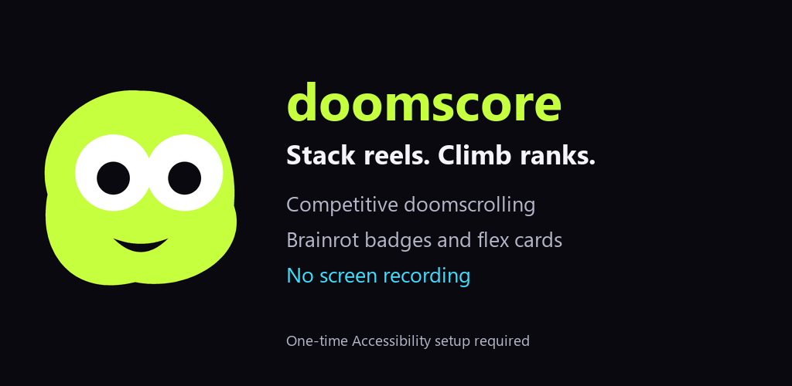

# DoomScore 🌀

**Stack reels. Climb ranks. Become the final boss of brainrot.**



DoomScore is a native Android app that turns scrolling into a scoreboard. After a one-time accessibility setup, open Instagram Reels and your score starts building automatically. Track your stats, unlock trophies, and watch **Goob**, your colour-changing mascot, evolve with your scroll rank.

Built with **Kotlin and Jetpack Compose**. No screen recording or screen sharing is required.

## Features

- **Automatic counting:** Instagram Reels and YouTube Shorts, with beta detectors for TikTok and Snapchat Spotlight.
- **Repeat and ad filtering:** stable-view detection, continuous-loop suppression, a recent-rewatch window, and recognized sponsored-label exclusion.
- **Your scrolling stats:** daily totals, full calendar-month scores, app/hour breakdowns, historical charts, personal bests, and active-day streaks.
- **Goob everywhere:** animated in-app mascot, draggable floating score pill, and rank colours from cyan through violet.
- **Quick access:** home-screen score widget, Quick Settings pause/resume tile, and optional live counter notifications.
- **Brainrot Trophy Cabinet:** persistent milestones, daily achievements, streaks, and verified online trophies.
- **Share the flex:** recap cards exported as PNGs.

### Doom League

The prepared Supabase backend adds monthly global competition:

- Global **top 50**, your exact rank through **#200**, and your top-percentile position below that.
- Unique usernames without an email/password sign-in screen; optional Instagram handles in profiles.
- Previous month's **#1, #2 and #3** featured with Instagram links during the first week of each month.
- Profile reporting, blocking, hiding, and identity deletion.

**Online features require backend deployment and configuration.** An unconfigured build works offline and keeps the online league and Battles disabled. Anonymous identities still use backend authentication; a username alone is not a recovery credential. League months use **UTC**; local daily stats use the phone's calendar.

## Brainrot Trophy Cabinet 🏆

| Badge | Unlock |
| --- | --- |
| One More Then I Sleep | 100 unique reels |
| For You? For Me. | 1,000 unique reels |
| Final Boss of Brainrot | 10,000 unique reels |
| Bed Rot Any% | 500 unique reels in one day |
| Chronically Online | Scroll 7 days in a row |
| Bro Got Outscrolled 💀 | Win your first completed Battle |
| Unemployed Behaviour | Win 5 completed Battles in a row |
| Touch Grass Is a Threat | Reach the global top 10 |

Online badges require verified server results. Battle-win badges stay locked until a trusted completed-match finalizer is connected; leading the live friend comparison does not award a win. See [TROPHIES.md](TROPHIES.md) for uniqueness and retention rules.

## How counting works

```text
Selected app's accessibility hierarchy
                  ↓
Detect a full-screen reel and exposed metadata
                  ↓
Exclude recognized ads, comments and unstable transitions
                  ↓
Require 750 ms of stable visibility
                  ↓
Suppress loops and recently seen identifiers
                  ↓
Save local totals → update stats, Goob and trophies
```

The counter reads exposed accessibility information from selected apps. It hashes identifiers with a per-install salt and keeps a **five-minute recent-rewatch window**. It does not count generic swipes or estimate reels from app usage time. Trophy uniqueness uses separately retained, bounded fingerprint sets.

**Accuracy depends on what other apps expose.** Identical or changing metadata, app updates, languages, and missing ad labels can affect recognition. “Unique” means a distinct metadata fingerprint, not a guaranteed unique underlying video. Not every ad or rewatch can be identified. TikTok and Snapchat support is beta.

## Native islands and live counters

Version **1.4.1** requests an Android 16 **Live Update** containing the count and Goob icon during an active reel session. Enable **Settings → Native island / Live Update**, allow notifications, and enable the phone's Live Alerts/Live Updates setting for DoomScore if available.

The phone controls promotion, placement, icon colours, and animation. Support is **not guaranteed for every built-in island**, and Android/manufacturer eligibility rules may exclude a passive reel counter. Actual native-island placement on the OnePlus phone remains unconfirmed. Earlier Android versions receive a regular silent notification.

The **Floating Goob pill** is a separate accessibility overlay. Disable **On-screen Goob counter** when testing native placement to avoid a duplicate pill. Notifications are optional and independent of counting. See [NATIVE-ISLAND.md](NATIVE-ISLAND.md) and [Android's Live Updates documentation](https://developer.android.com/develop/ui/views/notifications/live-update).

## Build locally

| Requirement | Version |
| --- | --- |
| Minimum Android | Android 8.0 / API 26 |
| Compile / target SDK | 36.1 / 36 |
| JDK | 21; Java compilation targets 17 |
| Gradle | 9.2.1, included wrapper |
| Android Gradle Plugin | 9.0.1 |
| Kotlin / R8 | 2.4.20 / 9.1.56 |

1. Clone this repository and open its root folder in Android Studio.
2. Install the required SDK and select Android Studio's bundled JDK.
3. Copy `local.properties.example` to `local.properties` and set your SDK path. Android Studio can also create the SDK entry.
4. Build and check the app:

```bash
./gradlew :app:assembleDebug :app:testDebugUnitTest :app:lintDebug
```

On Windows, use `gradlew.bat` with the same tasks. Debug APK: `app/build/outputs/apk/debug/app-debug.apk`.

For the signed, optimized production build, first configure the signing key and public release details described in [LAUNCH.md](LAUNCH.md), then run:

```bash
./gradlew :app:assembleRelease :app:bundleRelease :app:lintRelease
```

App name: **DoomScore**. Application ID: **`com.gridcc.doomscore.android`**. APK: `app/build/outputs/apk/release/app-release.apk`. Play Store bundle: `app/build/outputs/bundle/release/app-release.aab`. APKs and signing keys are excluded from this source repository.

## Start counting on your phone

1. Install your built APK and open DoomScore.
2. Read and accept the accessibility disclosure.
3. Enable **Doomscore reel counter** in Android Accessibility settings.
4. Open the full-screen Instagram Reels viewer and scroll.
5. Optionally enable a floating counter, native Live Update, widget, or Quick Settings tile.

Android may restrict accessibility for sideloaded APKs. If **Allow restricted settings** is available in the app's system App info menu, confirm it and return to Accessibility. The flow depends on the phone and Android version.

## Backend setup

Local counting needs no backend. For online features, review [backend/README.md](backend/README.md), [LEAGUE.md](LEAGUE.md), and [SECURITY.md](SECURITY.md) before applying migrations or deploying the ingest function.

- Configure an **HTTPS** Supabase URL and **publishable client key** in ignored `local.properties` or the documented environment variables.
- Keep service-role keys, CAPTCHA secrets, and signing passwords on the server or in protected local configuration.
- Deploy migrations, the ingest function, and the hosted CAPTCHA page to a staging project first.
- Verify ownership, row-level access, rate limits, CAPTCHA, moderation, and deletion before enabling online release flags.

Cloning or building does not deploy a live database. This Android app was originally developed as a counterpart to [berlinflix/doomscore](https://github.com/berlinflix/doomscore); its prepared backend contracts support coordination with that iOS project.

## Privacy and security

- No screenshots, screen capture, OCR, microphone, or camera are used for counting.
- Counting stays local unless the user opts into a configured online feature. Raw captions and trophy fingerprints are not uploaded.
- Android Keystore protects auth/device credentials; counting history lives in the app's private storage.
- HTTPS is enforced and app backups are disabled.
- Backend migrations scope record access, restrict client writes, validate inputs, and bound aggregate uploads.
- Private configuration, signing keys, generated builds, device verification data, and dependency folders are excluded from Git.

Accessibility can expose sensitive screen information. The app provides a prominent disclosure and limits tracking to selected supported apps. Review the included policy template and complete the Google Play accessibility declaration before public distribution.

## Verification and release status

The previous **1.4.1** build passed **51 JVM unit tests** and **4 notification integration tests**, including promotable notification characteristics, real dismissal actions, session cancellation, and mascot colour changes. Lint reported **0 errors and 67 warnings**; APK signing and 16 KB native alignment checks passed. These checks do not certify universal device compatibility or store approval. Version **1.4.2** adopts the final DoomScore app identity; temporary branded build variants have been removed.

Isolated PostgreSQL/security tests (Node 24):

```bash
npm ci --prefix backend/tests --ignore-scripts
npm test --prefix backend/tests
```

Android instrumented tests and the scripts in `tools/` are designed for an isolated emulator. **`feed-fixture` deliberately uses Instagram's package name to provide synthetic reels: never distribute it or install it on a phone with real Instagram.**

Production signing, public legal/support details, hosted backend verification, completed Battle finalization, and physical-device acceptance still need completion. [LAUNCH.md](LAUNCH.md) lists release gates; [VALIDATION.md](VALIDATION.md) records earlier validation runs.

## Project map

| Path | Purpose |
| --- | --- |
| `app/` | Android app, accessibility service, Compose UI, local storage, tests |
| `backend/` | Supabase migrations, ingest function, CAPTCHA page, database tests |
| `feed-fixture/` | Emulator-only synthetic reel feed |
| `gradle/` | Pinned Gradle wrapper |
| `release/` | Store graphics, listing draft, legal templates, acceptance checklist |
| `tools/` | APK verification, dependency scanning, emulator checks, release helpers |

More details: [Competition](COMPETITION.md) · [Trophies](TROPHIES.md) · [League](LEAGUE.md) · [UI](UI-EXPERIENCE.md) · [Security](SECURITY.md).
